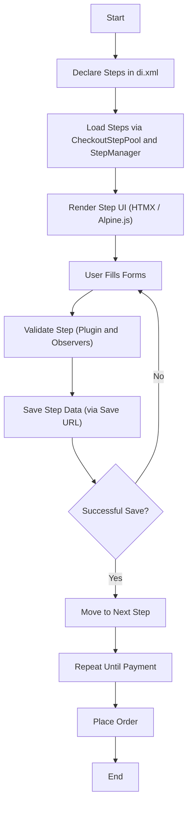

# Checkout Step System

MAHX Checkout implements a modular **checkout step system** for Magento 2.
Each step is composed of **one or more form components**, and supports:

- Dynamic saving (via HTMX / APIs)
- Customizable step order
- Easy addition of new steps or forms
- Event-based extension points

!!! tip
    Checkout steps are defined via **dependency injection** (`di.xml`) and loaded using the **StepManager** ViewModel.

---

## How Checkout Steps Work

- **Steps** are declared as **Virtual Types** under `CheckoutStepPool`.
- Each step has:
  - A **name** (`shipping`, `payment`, etc.)
  - A **label** (display text)
  - A **layout handle** (for rendering)
  - A **save URL** (HTMX target URL)
  - A list of **form components**
- **Form Components** are simple containers with:
  - A `name`
  - A `label`

Steps and forms are serialized for the frontend using `StepManager`.

!!! note
    Fields, buttons, and save behavior are fully customizable using Dependency Injection and Observers.

---

## Declaring Steps (in `di.xml`)

Steps are added via dependency injection in `etc/frontend/di.xml`.

=== "XML"

```xml
<type name="Rkt\MahxCheckout\Model\StepManager\CheckoutStepPool">
  <arguments>
    <argument name="steps" xsi:type="array">
      <item name="shipping" xsi:type="object">ShippingStepVirtual</item>
      <item name="payment" xsi:type="object">PaymentStepVirtual</item>
    </argument>
  </arguments>
</type>
```

Each step is a **VirtualType** extending `CheckoutStep`.

---

## Example: Shipping Step

=== "XML"

```xml
<virtualType name="ShippingStepVirtual" type="Rkt\MahxCheckout\Model\StepManager\CheckoutStep">
  <arguments>
    <argument name="name" xsi:type="string">shipping</argument>
    <argument name="label" xsi:type="string">Shipping</argument>
    <argument name="urlHash" xsi:type="string">shipping</argument>
    <argument name="saveDataUrl" xsi:type="string">mahxcheckout/shipping/saveShippingInformation</argument>
    <argument name="components" xsi:type="array">
      <item name="guest_email_form" xsi:type="object">GuestEmailForm</item>
      <item name="shipping_address_form" xsi:type="object">ShippingAddressForm</item>
      <item name="shipping_methods_form" xsi:type="object">ShippingMethodsForm</item>
    </argument>
  </arguments>
</virtualType>
```

---

## Rendering Steps on Frontend

The ViewModel `StepManager` provides useful methods:

| Method | Purpose |
|:-------|:--------|
| `getStepsInfo()` | Get full list of steps |
| `getStepsJson()` | Get steps in JSON format |
| `getCurrentStep()` | Get currently active step |
| `getHtmxIncludesForCurrentStep()` | Get HTMX includes for current step forms |

Example:

=== "PHP"

```php
/** @var \Rkt\MahxCheckout\ViewModel\StepManager $stepManager */
foreach ($stepManager->getStepsInfo() as $step) {
    echo $step->getLabel();
}
```

=== "JavaScript (HTMX)"

```html
<div hx-get="/mahxcheckout/step/load"
     hx-target="#step-container"
     hx-include="#current-step">
</div>
```

---

## Step Validation

Validation for steps (e.g., checking shipping address, payment info) is hooked via a **plugin**:

| Plugin Class | Purpose |
|:-------------|:--------|
| `ApplyStepValidation` | Validates steps after `isValid()` call |

It automatically validates shipping and payment steps using quote data.

---

# Customizing Checkout Steps

You can fully customize the checkout step system using **dependency injection** **and** **event observers**.

---

## What You Can Customize in a Step

| Area | How to Customize |
|:-----|:-----------------|
| Add a New Step | Define a new VirtualType and inject it |
| Change Step Order | Reorder the `steps` array in `di.xml` |
| Add/Remove Form Components | Modify the `components` array |
| Change Step Labels | Override `label`, `stepButtonLabel` |
| Change Save URL | Set a different `saveDataUrl` |
| Add Dynamic Validation | Use event observers |
| Skip/Hide Steps | Use observer or frontend HTMX/JS |
| HTMX Targeting | Customize `hx-include`, `hx-get` |
| Pre-process Save Requests | Observe save events |

!!! tip
    Observers allow runtime changes without changing the `di.xml` directly.

---

## Example: Adding a New "Gift Message" Step

### Step 1: Create a Virtual Type

=== "XML (di.xml)"

```xml
<virtualType name="GiftMessageStepVirtual" type="Rkt\MahxCheckout\Model\StepManager\CheckoutStep">
  <arguments>
    <argument name="name" xsi:type="string">gift_message</argument>
    <argument name="label" xsi:type="string">Gift Message</argument>
    <argument name="urlHash" xsi:type="string">gift-message</argument>
    <argument name="stepButtonLabel" xsi:type="string">Continue to Payment</argument>
    <argument name="saveDataUrl" xsi:type="string">mahxcheckout/gift/saveGiftMessage</argument>
    <argument name="components" xsi:type="array">
      <item name="gift_message_form" xsi:type="object">GiftMessageForm</item>
    </argument>
  </arguments>
</virtualType>
```

---

### Step 2: Insert the New Step

Add it between `shipping` and `payment`:

=== "XML"

```xml
<argument name="steps" xsi:type="array">
  <item name="shipping" xsi:type="object">ShippingStepVirtual</item>
  <item name="gift_message" xsi:type="object">GiftMessageStepVirtual</item>
  <item name="payment" xsi:type="object">PaymentStepVirtual</item>
</argument>
```

---

### Step 3: Customize Step Behavior Dynamically via Observer

=== "PHP"

```php
class CustomizeGiftStep implements ObserverInterface
{
    public function execute(Observer $observer): void
    {
        /** @var DataObject $transport */
        $transport = $observer->getData('transport');
        $steps = $transport->getData('steps');

        if (isset($steps['gift_message'])) {
            $steps['gift_message']->setLabel('Add a Special Message');
            $steps['gift_message']->setStepButtonLabel('Next: Payment');
        }

        $transport->setData('steps', $steps);
    }
}
```

---

## Event Observers You Can Use

| Event | Purpose |
|:------|:--------|
| `mahxcheckout_checkout_steps_prepared` | Modify step list before frontend rendering |
| `mahxcheckout_checkout_step_validated` | Hook into step validation dynamically |
| `mahxcheckout_checkout_save_before` | Intercept save payload before processing |

!!! note
    Observers make the checkout process **dynamic and flexible** without touching core logic.

---

## Best Practices for Step Customization

- **Use DI and Observers** rather than modifying core code.
- **Validate** all important fields at backend even if frontend checks exist.
- **Keep each step focused** (small number of forms per step).
- **Use events** (`mahxcheckout_checkout_steps_prepared`) for dynamic adjustment.
- Keep **saveDataUrl** API endpoints small and fast for good UX.

---

## Checkout Step Lifecycle

The following diagram shows the typical lifecycle of a checkout step:



## References

- [`StepManager`](src/ViewModel/StepManager.php)
- [`CheckoutStepPool`](src/Model/StepManager/CheckoutStepPool.php)
- [`CheckoutStep`](src/Model/StepManager/CheckoutStep.php)
- [`ApplyStepValidation`](src/Plugin/Model/StepManagerCheckoutStepInterface/ApplyStepValidation.php)

---
