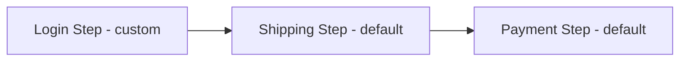

# Themes

MahxCheckout ships with a **default step-based theme**.
But you are not limited to it — you can create your **own custom themes**, either:

* A **standalone theme** (no inheritance), or
* A **child theme** that extends an existing theme.

This makes customizing checkout simple and flexible.

---

## Registering a Theme

Every theme must be registered in `di.xml`.

Example: let’s say you create a module `Awesome_MahxCheckoutTheme`.

**File:** `app/code/Awesome/MahxCheckoutTheme/etc/di.xml`

```xml
<?xml version="1.0"?>
<config xmlns:xsi="http://www.w3.org/2001/XMLSchema-instance"
        xsi:noNamespaceSchemaLocation="urn:magento:framework:ObjectManager/etc/config.xsd">
    <type name="MageHx\MahxCheckout\Model\Theme\CheckoutThemeRegistry">
        <arguments>
            <argument name="themes" xsi:type="array">
                <item name="awesome_theme" xsi:type="object">
                    Awesome\MahxCheckoutTheme\Model\Theme\AwesomeCheckoutTheme
                </item>
            </argument>
        </arguments>
    </type>
</config>
```

Now, create the **theme model** class:

**File:** `app/code/Awesome/MahxCheckoutTheme/Model/Theme/AwesomeCheckoutTheme.php`

```php
<?php

namespace Awesome\MahxCheckoutTheme\Model\Theme;

use MageHx\MahxCheckout\Model\Theme\CheckoutThemeAbstract;

class AwesomeCheckoutTheme extends CheckoutThemeAbstract
{
    public const THEME_CODE = 'awesome_theme';

    public function getCode(): string
    {
        return self::THEME_CODE;
    }

    public function getLabel(): string
    {
        return 'My Awesome Theme';
    }

    public function getParentCode(): ?string
    {
        return \MageHx\MahxCheckout\Model\Theme\DefaultCheckoutTheme::THEME_CODE;
    }
}
```

That’s it — your theme is registered! 🎉

* If you **return `null`** in `getParentCode()`, your theme will be **standalone**.
* If you return a parent code, your theme **inherits** steps and layouts from the parent.

💡 **Tip:** You only need to implement `CheckoutThemeInterface` to register a theme.
But using the provided `CheckoutThemeAbstract` base class is recommended — it gives you useful helpers for free.

---

## Why Theme Inheritance?

Inheritance saves time.
A child theme automatically gets:

1. **Steps** from the parent theme
2. **Layout handles** from the parent theme

You can then add, modify, or remove them as needed.

---

## Steps Inheritance

Example: your have a custom theme `awesome_theme`. You are trying to achieve
3 steps checkout as shown below:

---

### 🔍 Steps navigation you need



---

You declared your theme inherits from the **default theme**. Without doing anything,
your theme now has the **two steps** from default:

* Shipping
* Payment

Now you can extend this by adding a new step **Login**.

**File:** `app/code/Awesome/MahxCheckoutTheme/etc/frontend/di.xml`

```xml
<type name="MageHx\MahxCheckout\Model\StepManager\CheckoutStepPool">
    <arguments>
        <argument name="themeSteps" xsi:type="array">
            <item name="awesome_theme" xsi:type="array">
                <item name="login" xsi:type="object">
                    Awesome\MahxCheckoutTheme\Model\StepManager\Step\ShippingStepVirtual
                </item>
            </argument>
        </arguments>
    </type>

<virtualType name="Awesome\MahxCheckoutTheme\Model\StepManager\Step\ShippingStepVirtual"
             type="MageHx\MahxCheckout\Model\StepManager\CheckoutStep">
    <arguments>
        <argument name="name" xsi:type="string">Login</argument>
        <argument name="label" xsi:type="string">Login</argument>
        <argument name="urlHash" xsi:type="string">login</argument>
        <argument name="isDefault" xsi:type="boolean">true</argument>
        <argument name="stepButtonLabel" xsi:type="string">Go To Shipping</argument>
        <argument name="stepLayoutHandle" xsi:type="string">awesome_theme_login</argument>
        <argument name="saveDataUrl" xsi:type="string">awesome/login/saveLoginInfo</argument>
        <argument name="components" xsi:type="array">
            <item name="login_form" xsi:type="object">LoginForm</item>
        </argument>
    </arguments>
</virtualType>

<virtualType name="MageHx\MahxCheckout\Model\StepManager\Step\ShippingStepVirtual"
             type="MageHx\MahxCheckout\Model\StepManager\CheckoutStep">
    <arguments>
        <argument name="isDefault" xsi:type="boolean">false</argument>
    </arguments>
</virtualType>
```

### What’s happening here?

* You defined a **new "Login" step** and made it the **default step**.
* You updated the original **Shipping step** (defined by the default theme) so it is no longer default.
* End result: your theme now has **3 steps** — Login (custom), Shipping (default), Payment (default).

!!! note "Do you know?"

    👉 You can achieve the same customization with **event observers** if you prefer.

---

## Layout Inheritance

When a theme extends another, **all parent theme layout handles** are included automatically.

That means:

* You can use the parent’s layouts as-is
* You can **override them** in your theme’s own layout XML

### Example

Let’s say:

* `awesome_custom` inherits from `awesome_base`
* `awesome_base` inherits from `default`

Available layout handles:

```
mahxcheckout_theme_default
hyva_mahxcheckout_theme_default
mahxcheckout_theme_awesome_base
hyva_mahxcheckout_theme_awesome_base
mahxcheckout_theme_awesome_custom
hyva_mahxcheckout_theme_awesome_custom
```

!!! info

    👉 The `hyva_` handles are included **only when your storefront theme is Hyvä**.

This means your checkout theme will work **on both Luma and Hyvä stores** without extra effort.

---

✅ With these building blocks, you can:

* Create a fully custom checkout experience
* Extend existing themes safely
* Reuse steps and layouts across projects

---
